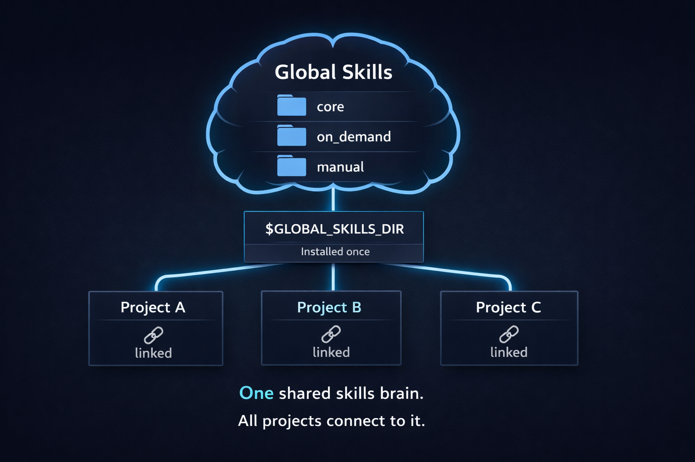

# 🌍 Global Skills

A **global, shared skills library** for AI-assisted development.  
Install once. Use everywhere. Any IDE. Any project.

---

## 🚩 The Problem

AI skills today are:
- Duplicated across projects
- Lost between tools
- Hard to keep consistent
- Painful to update

Every project ends up reinventing the same logic.

---

## 💡 The Solution

**Global Skills** introduces a single, stable skills library:

- One global location on your computer
- Linked to projects (not copied)
- Shared across all IDEs and tools
- Updated once, applied everywhere

> Think of it as **global AI memory** for your system.

---

## 🧠 How It Works



### How this works (in simple terms)

1. Download Global Skills **once** to your computer.
2. Activate it so it becomes available everywhere.
3. Link any project you want to it (Cursor, Antigravity, any IDE).
4. All projects share the same skills automatically.

One shared skills brain.  
All projects connect to it.

---

## 📊 Automatic Skill Usage Tracking

Global Skills includes a built-in mechanism that **automatically records which skills are actually used** while you work.

### What happens behind the scenes

- From the **very first prompt**, a background skill called **Skill Usage Documenter** runs silently
- It detects which global skills are activated by the AI
- It automatically creates and maintains a file called:


`skills-usage-document.md`


### Where can I find it?

- The file is created **inside your project**
- You can open it at any time to see which skills were used
- History is preserved and never rewritten

This turns Global Skills into a **measurable and observable system**, not a black box.

---

## 🗂 Folder Structure

```
global-skills/
├─ core/          # Always active, safe skills
├─ on_demand/     # Auto-used by context
├─ manual/        # Explicit-only, never auto
├─ user_custom/   # Personal local skills (ignored by git)
│  ├─ core/
│  ├─ on_demand/
│  └─ manual/
├─ scripts/
├─ assets/
│  └─ global-skills-diagram.png
└─ README.md
```

---

## 🧩 Skill Categories

| Category     | Behavior                  | Safety |
|--------------|---------------------------|--------|
| core         | Always active             | ✅ Safe |
| on_demand    | Triggered by context      | ✅ Safe |
| manual       | Explicit invocation only  | ⚠️ Risk |
| user_custom  | Local personal extensions | 🧪 User |

---

## ⚙️ Installation (Linux / macOS / Windows)

### 1️⃣ Clone

**Linux / macOS (Terminal):**
```bash
git clone https://github.com/belkheertamam/global-skills.git "$HOME/.global-skills"
```

**Windows (PowerShell):**
```powershell
git clone https://github.com/belkheertamam/global-skills.git "$env:USERPROFILE\.global-skills"
```

---

### 2️⃣ Install

**Linux / macOS:**
```bash
bash "$HOME/.global-skills/scripts/install.sh"
```

**Windows (WSL or Git Bash recommended):**
```bash
bash "$HOME/.global-skills/scripts/install.sh"
```

> Windows users are recommended to use **WSL** or **Git Bash** for full compatibility.

---

### 3️⃣ Reload your shell

**Linux / macOS:**
```bash
source ~/.bashrc
```
# or
```
source ~/.zshrc
```

**Windows (WSL / Git Bash):**
```bash
source ~/.bashrc
```

---

### 4️⃣ Verify

**Linux / macOS:**
```bash
echo $GLOBAL_SKILLS_DIR
```

**Windows (PowerShell):**
```powershell
echo $env:GLOBAL_SKILLS_DIR
```

Expected output:

`~/.global-skills`

---

## 🔗 Using Global Skills in a Project

```bash
cd <your-project>
bash "$GLOBAL_SKILLS_DIR/scripts/link-project-to-global-skills.sh"
```

This creates:

`.global-skills.env`

---

## 🧠 Required Initial Prompt (Important)

Paste **once**, as the **first message** in your AI session:

```text
This project is explicitly linked to a global skills system via `.global-skills.env`.

Global skills are part of the project’s native reasoning baseline.
Core skills are always active.
On-demand skills activate by context.
Manual skills must never be used unless explicitly requested.

The Skills Usage Documenter runs silently from the first prompt.
It tracks actual skill usage and updates `skills-usage-document.md` without rewriting history.

Global skills behave as native project memory for the entire session.
```
---

## ⚠️ User-Specific File (`.global-skills.env`)

The file `.global-skills.env` contains **machine-specific paths**
(e.g. your home directory on Linux, macOS, or Windows).

If your project uses Git and you do **not** want to commit local paths,
add this line to your project’s `.gitignore`:

```
.global-skills.env
```
---

## 🤖 Alternative: Ask an AI Agent to Update `.gitignore`

You may copy and paste the prompt below into your IDE’s AI agent
(Cursor, Anti-Gravity, etc.):

```text
This project uses Global Skills.

The file `.global-skills.env` contains machine-specific paths and must not be committed.

Task:
- If this project uses Git and a `.gitignore` file exists, add:
  .global-skills.env
- If `.gitignore` does not exist, ask before creating it.

Rules:
- Do not commit anything.
- Do not modify any other files.

Report what you changed.
```

---

## 🔄 Updating Global Skills

```bash
cd "$GLOBAL_SKILLS_DIR"
git pull
```

No reinstall.  
No relinking.  
All projects update automatically.

---

## 🧩 Create a Custom Skill (No Coding Required)

You can create your own local skills without writing code or touching this repository.

Use your IDE AI agent (Cursor, Anti-gravity, etc.) and paste the prompt below.
The agent will create the skill for you inside `user_custom`.

```text
You are working in a project linked to Global Skills.

Your task is to create a NEW local custom skill.

================================================
USER INPUTS — FILL THESE ONLY
================================================

Skill name:
<WRITE THE SKILL NAME HERE>

Category (KEEP ONE, DELETE THE OTHER TWO):
- core
- on_demand
- manual

What the skill does:
<DESCRIBE IN SIMPLE WORDS WHAT YOU WANT>

Optional (if you want):
- Extra rules or notes
- Examples
- Attach a file that describes the skill (use it as reference)

================================================
DO NOT CHANGE ANYTHING BELOW
================================================

Rules:
1) Create the skill at:
   $GLOBAL_SKILLS_DIR/user_custom/<category>/<skill_name>/

2) Create a file named:
   SKILL.md

3) Structure SKILL.md with:
   - Purpose
   - When to use
   - What it does
   - Rules
   - Examples (if any)

4) If the folder already exists, create a new one with -v2 (do not overwrite).

5) Do NOT modify anything outside user_custom.

After creation:
- Show the created path
- Show the full SKILL.md content
- Confirm no other files were modified
- Create the files on disk
```

---

## 📌 Summary

- Install once
- Link projects
- Update globally
- Zero duplication
- Clean structure
- Full control